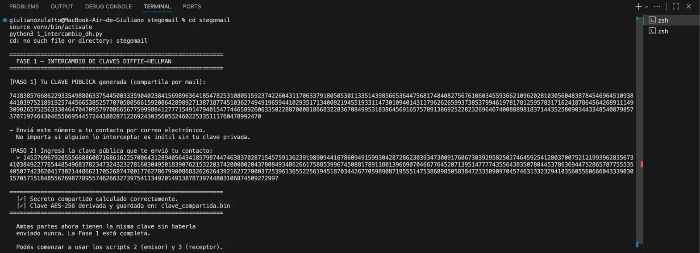
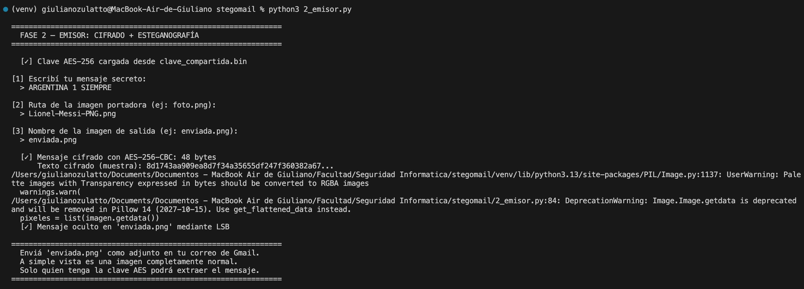
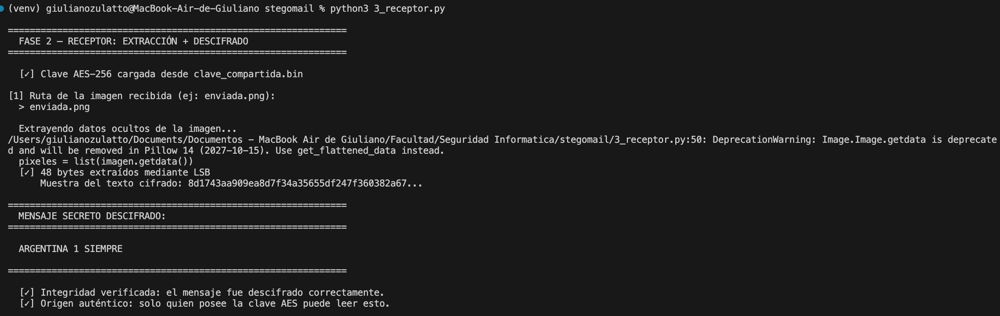

# StegoMail 🔐

**Sistema híbrido de comunicación cifrada y esteganográfica sobre correo electrónico gratuito**

*Hybrid system for encrypted and steganographic communication over free email services*

---

## ¿Qué es StegoMail? / What is StegoMail?

StegoMail permite que dos personas intercambien mensajes secretos a través de Gmail (o cualquier servicio de correo gratuito) **sin levantar sospechas**. El receptor recibe un correo completamente ordinario con una imagen adjunta — nadie puede saber que dentro de esa imagen hay un mensaje cifrado.

*StegoMail allows two people to exchange secret messages through Gmail (or any free email service) without raising suspicion. The recipient receives a completely ordinary email with an image attached — nobody can tell that inside that image there is an encrypted message.*

El sistema combina tres técnicas:

| Técnica | Propósito |
|---|---|
| **Diffie-Hellman (DH)** | Acordar una clave secreta compartida sin contacto previo |
| **AES-256-CBC** | Cifrar el mensaje para que sea ilegible |
| **Esteganografía LSB** | Ocultar el mensaje cifrado dentro de una imagen |

---

## Requisitos / Requirements

- Python 3.8 o superior
- pip

---

## Instalación / Installation

```bash
# 1. Clonar el repositorio / Clone the repository
git clone https://github.com/giuliano-z/stegomail.git
cd stegomail

# 2. Crear entorno virtual / Create virtual environment
python3 -m venv venv

# 3. Activar entorno virtual / Activate virtual environment
# Mac / Linux:
source venv/bin/activate
# Windows:
venv\Scripts\activate

# 4. Instalar dependencias / Install dependencies
pip install Pillow cryptography
```

---

## Uso / Usage

### Fase 1 — Intercambio de claves (una sola vez)
### *Phase 1 — Key exchange (only once)*

Ambas partes ejecutan este script de forma independiente.  
*Both parties run this script independently.*

```bash
python3 1_intercambio_dh.py
```

**Flujo / Flow:**
1. El script genera tu clave pública y la muestra en pantalla
2. Enviás ese número por correo a tu contacto (no importa si alguien lo intercepta)
3. Ingresás la clave pública que te envió tu contacto
4. Ambos calculan independientemente el mismo secreto compartido → se guarda en `clave_compartida.bin`

> ⚠️ **Importante:** `clave_compartida.bin` nunca debe compartirse ni subirse a ningún repositorio. Es la clave secreta del sistema.

---

### Fase 2 — Enviar un mensaje cifrado
### *Phase 2 — Send an encrypted message*

```bash
python3 2_emisor.py
```

**El script te pedirá / The script will ask for:**
1. El mensaje secreto que querés enviar
2. La ruta de la imagen portadora (cualquier foto PNG)
3. El nombre de la imagen de salida (ej: `enviada.png`)

Luego **adjuntás `enviada.png` en un mail de Gmail** con cualquier texto cotidiano. A simple vista es una imagen completamente normal.

> ⚠️ **Importante:** Usá siempre imágenes en formato **PNG**. Otros formatos como JPEG comprimen la imagen y destruyen el mensaje oculto.

---

### Fase 2 — Recibir y descifrar un mensaje
### *Phase 2 — Receive and decrypt a message*

```bash
python3 3_receptor.py
```

**El script te pedirá / The script will ask for:**
1. La ruta de la imagen recibida

El mensaje secreto aparecerá descifrado en la terminal.

---

## Demo / Demo

### Fase 1 — Intercambio de claves Diffie-Hellman
*Ambas partes intercambian sus claves públicas por correo. El número es enorme — y eso es exactamente lo que lo hace seguro.*



---

### Fase 2 — Emisor: cifrado AES + esteganografía LSB
*El mensaje es cifrado con AES-256 e incrustado en la imagen portadora.*



---

### Fase 2 — Receptor: extracción y descifrado
*El receptor extrae el mensaje oculto de la imagen y lo descifra.*



---

## Estructura del proyecto / Project structure

```
stegomail/
├── 1_intercambio_dh.py   # Fase 1: intercambio de claves Diffie-Hellman
├── 2_emisor.py           # Fase 2: cifrado AES + esteganografía LSB
├── 3_receptor.py         # Fase 2: extracción LSB + descifrado AES
├── demo/                 # Capturas de la demostración
├── .gitignore            # Excluye clave_compartida.bin y archivos sensibles
└── README.md
```

---

## Consideraciones de seguridad / Security considerations

- ✅ Nunca subas `clave_compartida.bin` al repositorio
- ✅ Usá siempre imágenes PNG como portadoras
- ✅ La imagen de salida (`enviada.png`) tampoco debe subirse al repo
- ✅ Si la clave es comprometida, regenerála ejecutando nuevamente el Script 1
- ✅ Los parámetros Diffie-Hellman usados corresponden al grupo 14 del RFC 3526 (2048 bits), auditado internacionalmente

---

## Contexto académico / Academic context

Trabajo Práctico — Seguridad Informática  
Ingeniería en Software — Universidad Siglo 21  
Período Académico 1A 2026  
Docente: Ing. Mario A. Groppo

---

*Made with 🔐 and 🇦🇷*